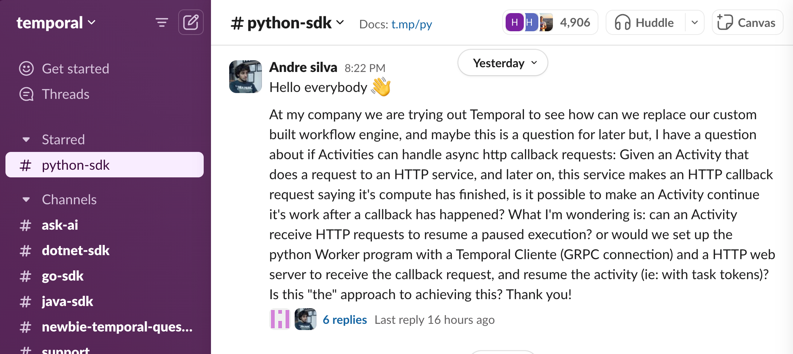
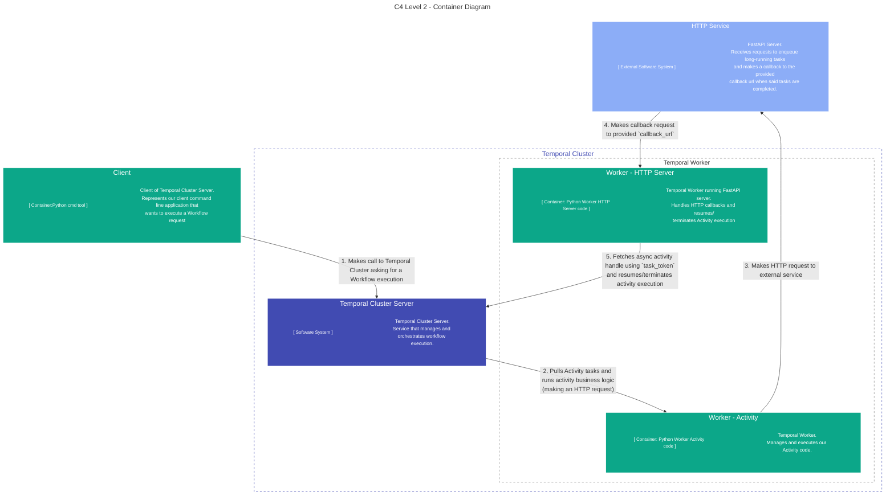
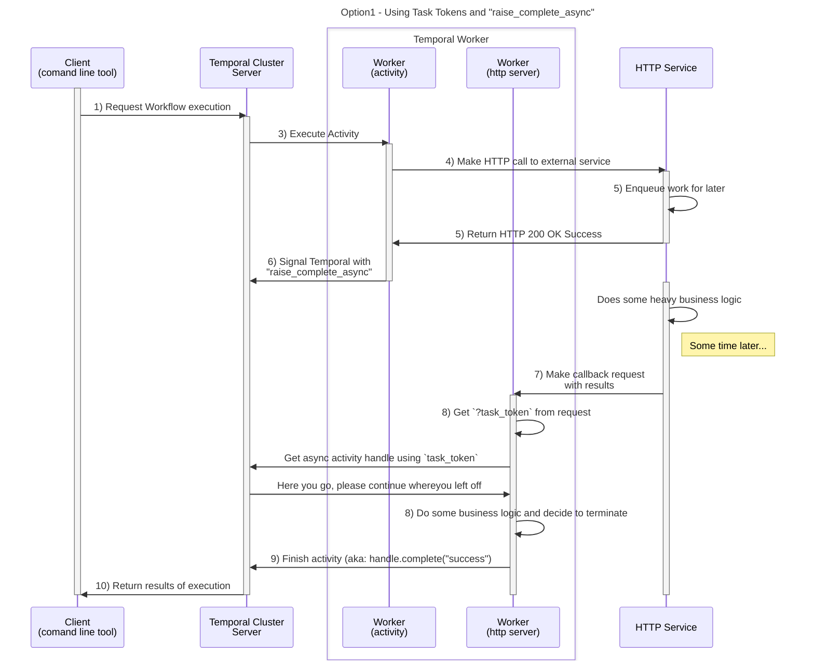

# Temporal's Async Activites

This repo explores how we can achieve the functionality detailed in this comment on [Temporal's Community Slack](https://temporal.io/community) ([slack thread](https://temporalio.slack.com/archives/CTT84RS0P/p1721244171715119)):


> Hello everybody 👋 <br>
> At my company we are trying out Temporal to see how can we replace our custom built workflow engine, and maybe this is a question for later but, I have a question about if Activities can handle async http callback requests: Given an Activity that does a request to an HTTP service, and later on, this service makes an HTTP callback request saying it's compute has finished, is it possible to make an Activity continue it's work after a callback has happened? What I'm wondering is: can an Activity receive HTTP requests to resume a paused execution? or would we set up the python Worker program with a Temporal Cliente (GRPC connection) and a HTTP web server to receive the callback request, and resume the activity (ie: with task tokens)? Is this "the" approach to achieving this? Thank you!


### Table of Contents
* [Overview](#overview)
* [Project Structure](#project-structure)
* [Usage](#usage)
* [Setup](#setup)
  + [Client Command](#client-command)

## Overview




This project explores how can we implement the "webhook" or "callback" pattern using Temporal primitives.

This approach is as described in the sequence diagram below:
1. Our Temporal Client (a simple "client" commandline tool) makes a request to start a workflow execution.
2. Then our Temporal Cluster enqueues the workflow task for a Worker to pick up.
   * Our Worker code is handling both "Workflow" and "Activity" code for simplificty
   * In this diagram we don't describe the "Workflow" interaction since it doesnt add much to the usecase at hand.
3. Our Workflow Worker picks up the task and executes an Activity.
4. Our Activity run its code which is simply making a request to an external HTTP Service.
   * To note that this is a simple POST /request to this external HTTP Service.
   * The important detail is the payload which contains a **`callback_url`**  which HTTP Service requires to make the callback later on
   * This Callback url is simply the "URL for the Worker HTTP Server" + "the activity Task Token"
     * ie: `callback_url="http://worker-http-server:8000/callback?task_token=....`
5. The HTTP Service receives the request, enqueues its work for later and returns a HTTP 200 OK
6. The activity signals Temporal cluster that is has finish its work using `activity.raise_complete_async()`
7. Some time later, our HTTP Service makes the callback request and our Worker HTTP Server receives it
8. The Worker HTTP Server then gets the activity handle using the `?task_token` from the callback request and continues with its busines process.
9. The Worker HTTP Server decides to terminate the Activity by sending a `handle.complete` to temporal Cluster, which ends the Activity and concludes the Workflow execution.
10. Finally, our Temporal Client receives its response and the loop is finished.


## Project Structure

A brief descrition of how the project is structured:

```bash
~ $ tree 
.
├── README.md                # You are here :)
├── Makefile                 # Commands to manage and work with the project
├── Dockerfile               # Docker + docker-compose files to setup for the whole project 
├── docker-compose.yml       
├── pyproject.toml           # Python dependencies
├── poetry.lock
├── __init__.py
├── settings.py              # Temporal Cluster + Temporal Worker settings.
├── client.py                # Client cmd tool. Requests Workflow executions to Temporal Cluster
├── worker.py                # Temporal Worker. Handles Workflows and Activity tasks 
├── http_service.py          # Simple FastAPI server that works as "External HTTP Server"
├── workflows
│   ├── __init__.py
│   └── call_service.py      # Our Workflow that just runs a single "Async" Activity
├── activities
│   ├── __init__.py
│   └── async_activity.py    # Our Activity code that has a "Run" (main activity) and "Callback" (handle callback) methods 
└── gateways
    ├── __init__.py
    └── http_api_gateway.py  # Simple Gateway pattern to "External HTTP Server" 
```

## Usage

All commands on this project can be found on its `Makefile`. You can run and manage it using those.
Everything is run using Docker, so make sure to install it first. Here is a list of all available commands:

**For project development lifecycle**:
- `make build`: Builds `Dockerfile` container image for local development;
- `make shell`: Opens a `/bin/bash` shell on the built `Dockerfile` container;
- `make clean`: Stops, destroys and cleans all containers, volumes and networks. Resets the projects for a fresh installation;
- `make lint`: Runs linting tool for formatting the codebase. (If you don't have `ruff` installed on your machine, only run this after `make shell`.)

**For running the project**:
- `make up`: Startups and runs local Temporal Cluster Server + Temporal Worker + External HTTP service;
- `make client`: Runs the Temporal Client command tool and starts our workflow.

## Setup

You can set up this project locally just by running `$ make build`, which will build the base Python image for this project to run:

```bash
$ make build
```

Once the project has finish building you can spin up all dependencies just by running:

```bash
$ make up
```
This will start 4 things:
* **Temporal Cluster Server**: Temporal service that manages our workflow executions;
* **Temporal UI**: Backoffice tool for managing workflows. You can access it on `localhost:8080`;
* **Temporal Worker**: Temporal Worker that handles both our Workflow and our Activity implementations;
* **External HTTP Service**: A simple FastAPI server that exposes a `POST /request` endpoint which after some time, makes a POST request to a provided `callback_url`.

To then run a workflow execution, just run the `$ make client` command:

```bash
$ make client
```

While you are testing or developing it might be useful to enter the Python container or use a python shell directly.
You can do that by running the following:

```bash
# Enter in a python docker container
$ make shell
# Run a specific client request
[shell container] $ python3 -m client -time-to-request 10 --time-to-callback 20 --activity-action complete

```

If everything went well, you should be able to open you `localhost:8080` and see your workflow request green! ✅

### Client Command

The command that requests a workflow execution through Temporal Cluster can be found on `~/client.py`. We've added the shortcut `$ make client` utility to make it easier to run.

```bash
$ python3 -m client --help
Usage: python -m client [OPTIONS]

Options:
  -ttr, --time-to-request INTEGER
                                  How much time (in seconds) the HTTP Service waits until it returns an HTTP 200 OK response to the activity
                                  [default: 1]
  -ttc, --time-to-callback INTEGER
                                  How much time (in seconds) the HTTP Service waits until it makes a callback request to the Worker HTTP /callback endpoint
                                  [default: 10]
  -a, --activity-action [heartbeat|complete|fail|report_cancellation|ignore]
                                  Which activity action do we want the activity to perform. (maps to the different handle options described on  https://docs.temporal.io/develop/python/asynchronous-activity-completion).
                                  [default: complete]
  --help                          Show this message and exit.
```

Some examples:

[ℹ️ Default behaviour] **Request a Workflow that takes 1 second to receive a HTTP 200 OK from the External HTTP Service, and 10 seconds to receive a callback with the "complete" action for the Activity to run**
```bash
$ python3 -m src.client
```

**Request a Workflow that takes 10 seconds to receive an HTTP 200 OK and 1 second to receive a callback with a "complete" Activity action**
```bash
$ python3 -m src.client --time-to-request 10 --time-to-callback 1 --activity-action complete
```

**Request a Workflow that takes both 1 seconds to receive an HTTP 200 OK and to get the callback with a "fail" Activity action**
```bash
$ python3 -m src.client --time-to-request 1 --time-to-callback 1 --activity-action fail
```
